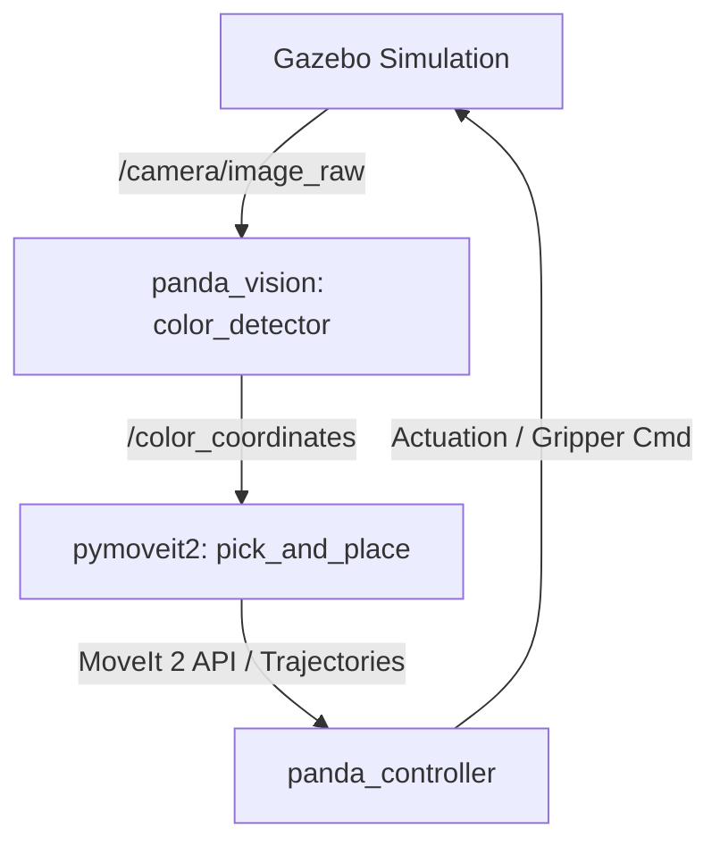

# Codebase Review: Franka Panda Color Sorting Robot

This document provides a comprehensive review of the **Franka Panda Color Sorting Robot** codebase located under [franka_pandas_cli](file:///D:/2026/franka_pandas_cli).

---

## 📋 Executive Summary

The project is a **ROS 2-based robotic system** simulating a Franka Emika Panda arm that dynamically sorts colored blocks (Red, Green, Blue) in Gazebo using OpenCV for vision and MoveIt 2 for trajectory execution. The codebase is well-structured as a set of modular ROS 2 packages. However, it contains several hardcoded parameters, camera calibration workarounds, and potential blocking issues in its execution flow that could be optimized for robust and general-purpose operation.

---

## 🏗️ System Architecture & Components

The system architecture consists of a classic perception-planning-actuation pipeline:
1. **Perception (`panda_vision`)**: Subscribes to the raw Gazebo camera stream, processes frames with OpenCV to identify colored contours, transforms coordinates from the camera link to the robot base link, and publishes target 3D coordinates.
2. **Planning (`panda_moveit`, `pymoveit2`)**: Integrates MoveIt 2 configs for motion planning. It provides a high-level Python API wrapper (`pymoveit2`) to control joints and cartesian motion.
3. **Control (`panda_controller`)**: Handles ROS 2 controllers (e.g., Joint Trajectory Controller for arm, Gripper action controller).
4. **Robot Model (`panda_description`)**: Contains URDF and Xacro files defining the robot, visual meshes, worlds, and integrated Gazebo sensors.
5. **System Bringup (`panda_bringup`)**: Coordinates launch files to stand up the simulation, visualization, and perception pipelines.



---

## 🔍 Deep-Dive Review of Key Packages & Nodes

### 1. `panda_vision` & [color_detector.py](file:///D:/2026/franka_pandas_cli/panda_vision/panda_vision/color_detector.py)

This node performs 2D color segmentation in the HSV color space and projects the detected center pixels into 3D camera coordinates, which are then transformed into the robot base frame (`panda_link0`) using `tf2_ros`.

#### 🔴 Observations & Weaknesses
* **Hardcoded Intrinsic Parameters (Lines 32–35):**
  ```python
  self.fx = 585.0
  self.fy = 588.0
  self.cx = 320.0
  self.cy = 160.0
  ```
  *Issue:* Any changes to camera resolution or sensor configuration in the Gazebo SDF model will invalidate these parameters, causing inaccurate 3D projections.
  *Fix:* Subscribe to the camera's `/camera/camera_info` metadata topic and extract the intrinsic matrix ($K$) dynamically.
* **Simplistic Depth Assumption (Line 80):**
  ```python
  Z = 0.1  # Assumed depth/distance
  ```
  *Issue:* Assumes a fixed depth of $10\text{ cm}$ from the camera. If objects vary in height or the camera height changes, calculations fail.
* **Arbitrary Scale Factor & Coordinate Conversions (Lines 81–82):**
  ```python
  Y = (cx_pix - self.cx) * Z / self.fx * -10
  X = (cy_pix - self.cy) * Z / self.fy
  ```
  *Issue:* The multiplier `-10` is an ad-hoc calibration hack. Usually, coordinate calculations in ROS camera frames do not require arbitrary scale factors unless the input units/distances are misconfigured.
* **Incomplete Red HSV Range (Lines 52–55):**
  ```python
  "R": [(0, 120, 70), (10, 255, 255)]
  ```
  *Issue:* Red wraps around $180^\circ$ in HSV (typically $0\text{–}10$ and $170\text{–}180$). Darker or orange-red hues might be missed since the upper red range is not checked.
* **Color-Specific Calibration Offsets (Lines 116–119):**
  ```python
  if color_id == "B":
      pt_base[1] -= 0.0215
  elif color_id == "G":
      pt_base[1] += 0.02
  ```
  *Issue:* Hardcoding adjustments for specific color IDs indicates visual bias or misalignment in color contours that should be corrected at the image processing level, not by shifting coordinates based on color.

---

### 2. `pymoveit2` & [pick_and_place.py](file:///D:/2026/franka_pandas_cli/pymoveit2/examples/pick_and_place.py)

This is the main state machine governing the pick-and-place operation, using predefined joint positions for the start, home, and drop configurations.

#### 🔴 Observations & Weaknesses
* **Blocking Callbacks (Lines 104–160):**
  *Issue:* The entire pick-and-place sequence is executed sequentially inside `coords_callback` upon receiving a target coordinate.
  *Consequence:* Doing blocking actions (like waiting for motion execution) inside subscription callbacks can lock up execution threads in ROS 2. Even with a `MultiThreadedExecutor`, this model is non-standard.
  *Fix:* The callback should only store/lock the coordinates and set a state variable. A separate loop or timer should trigger the execution sequence asynchronously.
* **Large Z-Offset Workaround (Line 101):**
  ```python
  pick_position = [self.target_coords[0], self.target_coords[1], self.target_coords[2] - 0.60]
  ```
  *Issue:* Subtracting $0.60\text{ m}$ ($60\text{ cm}$) from the detected Z-coordinate indicates a structural discrepancy between the camera coordinate frame's Z-axis output and the workspace coordinate frame, pointing back to coordinate projection mismatches in `color_detector.py`.
* **Missing Retraction / Lift Phase (Lines 137–138):**
  ```python
  # 6. Lift up back to pick_position
  # self.moveit2.move_to_pose(position=pick_position, quat_xyzw=quat_xyzw)
  # self.moveit2.wait_until_executed()
  ```
  *Issue:* The lift phase after grabbing the object is commented out. The robot goes directly from the surface level straight to the `home` configuration. In complex environments, this will cause the robot to drag the item across the workspace or collide with obstacles.
* **Node Termination (Line 161):**
  ```python
  rclpy.shutdown()
  ```
  *Issue:* The node shuts down ROS 2 after a single iteration. For a continuous production sorting process, this script requires external wrapper restarts.

---

### 3. Launch & Simulation Packages

* **`panda_bringup` (Launch Configuration):**
  * [pick_and_place.launch.py](file:///D:/2026/franka_pandas_cli/panda_bringup/launch/pick_and_place.launch.py) cleanly integrates Gazebo, the controller manager, and MoveIt. The vision and pick-and-place node execution are modular and can be enabled/disabled conveniently.
* **`panda_description` (Mesh and Kinematics):**
  * Highly modular URDF design dividing the arm, gripper, sensors, and ros2_control Gazebo parameters.

---

## ✨ Key Strengths

1. **Modular Packaging:** Separation of concerns between description, control, vision, and planning is aligned with ROS 2 best przactices.
2. **Docker Ready:** The inclusion of a Docker build context ensures dependencies like OpenCV, PyMoveIt2, and ROS 2 Humble packages run deterministically.
3. **Clean PyMoveIt2 Wrapper:** Utilizes action interfaces under-the-hood to communicate with MoveIt, keeping high-level logic compact and readable.

---

## 🚀 Recommended Enhancements

### 🎯 Short-Term Fixes (Low Effort)
1. **Uncomment & Standardize the Lift Phase:** Enable step 6 in `pick_and_place.py` so the arm rises vertically by at least $10\text{ cm}$ after grasping to prevent dragging.
2. **Optimize Red Color Masking:** Modify the HSV detector to check two HSV ranges for Red (0–10 and 170–180) to improve detection accuracy under variable lighting.

### ⚙️ Long-Term Enhancements (High Value)
1. **Dynamic Camera Intrinsic Lookup:** Subscribe to `/camera/camera_info` and use the camera matrix ($K$) to calculate the 3D optical projection. This eliminates hardcoded focal lengths and makes the node independent of camera properties.
2. **Asynchronous Execution Pattern:** Refactor the subscriber in `pick_and_place.py` so that it doesn't block. Move the pick-and-place state machine into an action client or a dedicated worker thread using state variables.
3. **Continuous Execution:** Remove `rclpy.shutdown()` from `pick_and_place.py` and replace it with a state machine loop to allow the robot to continually sort incoming blocks instead of shutting down.
